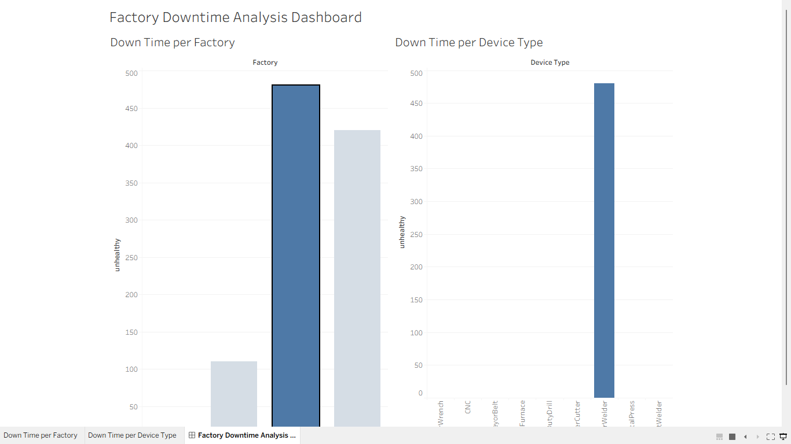

# 📊 Factory Downtime Analysis Dashboard

## 🔍 Overview
This project analyzes machine downtime across multiple factories using Tableau.

## 🎯 Objective
- Identify the factory with the highest downtime  
- Identify the most failure-prone device types  

## 🛠 Tools Used
- Tableau

## 📈 Key Insights
- Highest downtime factory: Daikibo Seiko (Japan)
- Most failure-prone device: LaserWelder

## 🔗 Live Dashboard
[View Dashboard](https://public.tableau.com/app/profile/jesiliya.johnson/viz/FactoryDowntimeAnalysisDashboard_17773638947800/FactoryDowntimeAnalysisDashboard)
## 🖼️ Dashboard Preview

